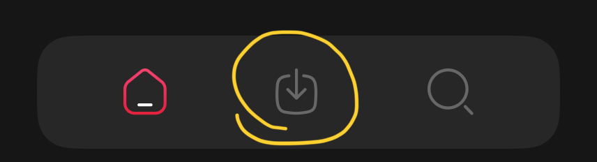

# YouTubeの広告削除

## iOS
YouTube改造アプリである uYou Enhancedのインストール方法です。  
広告削除以外に以下の機能があります。

- バックグラウンド再生
- MP4/MP3などへのダウンロード(オフライン再生)

他にもたくさんあります。
#### 1 Scarletのインストール
- まず[ここ](https://usescarlet.com)へアクセスします。  
- 次に「Install」を押します。※スマホの場合は下までスクロールしないと表示されません。  
- 赤いボタンが5つあるページに飛ぶので、一番上にある「Direct Install」を押します。
- Please wait as Scarlet installs.と表示されたら10秒待つ。
- このページをiTunesで開きますか？→開くを押す。
- 〜によってscarletがインストールされます→インストールを押す。
- Scarletがインストールされたら　設定<一般<VPNとデバイス管理<エンタープライズApp<〜を信頼を押す。

#### 2 uYou Enhancedのダウンロード
- [ここ](https://github.com/arichornlover/uYouEnhanced/releases)から最新バージョンのuYouEnhanced_〜.ipaをタップしてダウンロードする。
#### 3 uYou Enhancedのインストール
- ホーム画面にあるScarletを開きます。
- 下のバーから真ん中のものを選ぶ。

- 右上のアイコンを押す。
